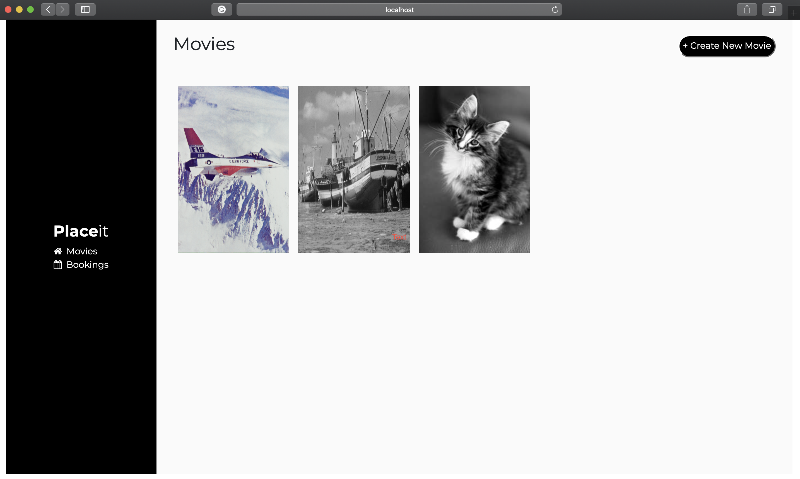

  <h1 align="center">Movie Booking - Front End - Ruby on Rails</h1>

  

 

This project consist of an small movie booking system using Ruby on Rails on back end and ReactJS on front end.

[Back End](https://github.com/AndresFMoya/ror-booking_cinema_backend)

In this project, we will build a Web App with the following technologies:
- API
  - Ruby on Rails
  - PostgreSQL
  - GraphQL

- Frontend
  - React
  - Apollo Client

## Technologies used

- Ruby on Rails
- RSpec
- PostgreSQL
- Apollo Client
- GraphQL
- Git
- Bootstrap
- HTML & CSS
- ReactJS
- Docker
- TravisCI (CI/CD)

## [Live Version](https://movie-booking-front.herokuapp.com/)

##  Potential Future Features

- Implement an Authentication/Authorization System
- Improve and clean UI.
- Add field type validation.

## 🤝 Contributing

Contributions, issues and feature requests are welcome! Feel free to check [issues page](https://github.com/AndresFMoya/ror-booking_cinema_frontend/issues).

1. Fork it (https://github.com/AndresFMoya/ror-booking_cinema_frontend/fork)
2. Create your working branch (git checkout -b [choose-a-name])
3. Commit your changes (git commit -am 'what this commit will fix/add/improve')
4. Push to the branch (git push origin [chosen-name])
5. Create a new pull request

## Contributors

Andrés Moya - [GitHub](https://github.com/andresfmoya)

## Show your support

Give a ⭐️ if you like this project!

## License

This project is [MIT](https://github.com/AndresFMoya/ror-booking_cinema_frontend/blob/develop/LICENSE) licensed.

## 📞 Get in Touch!
I will love to hear about you at one of the following places! :heart:

- [LinkedIn](https://www.linkedin.com/in/andres-f-moya/)
- [Twitter](https://www.twitter.com/andmedev/) 
- <andresfmoya@gmail.com>.

  <strong>
    <a href="https://andresmoya.me">andresmoya.me</a>
</strong>

